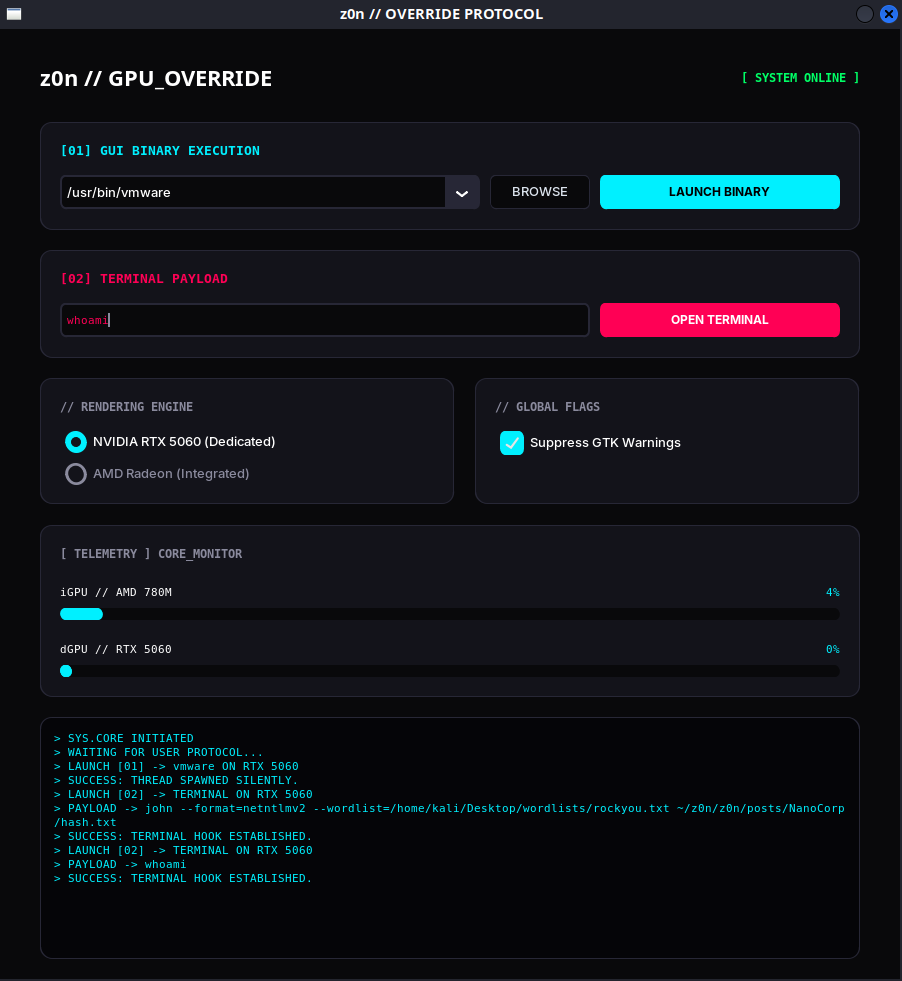
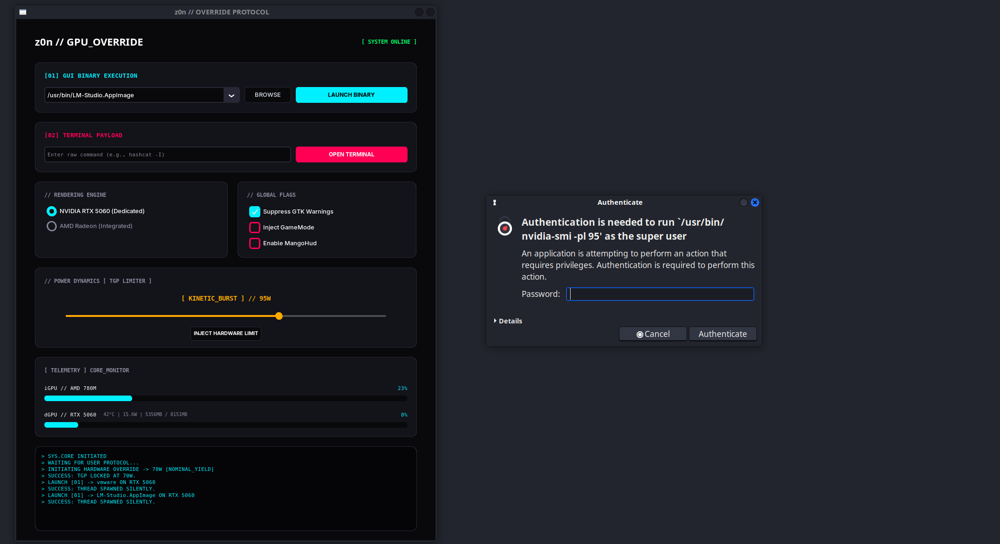
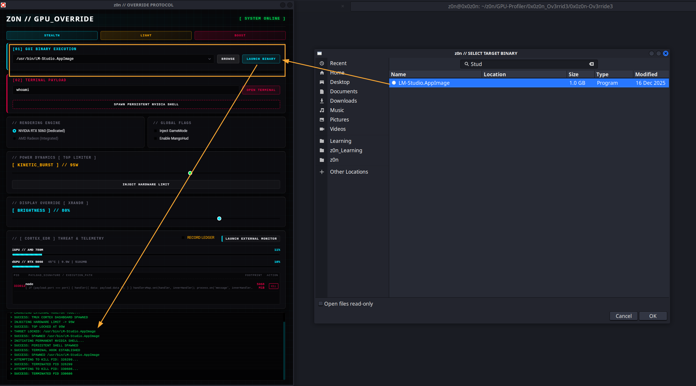
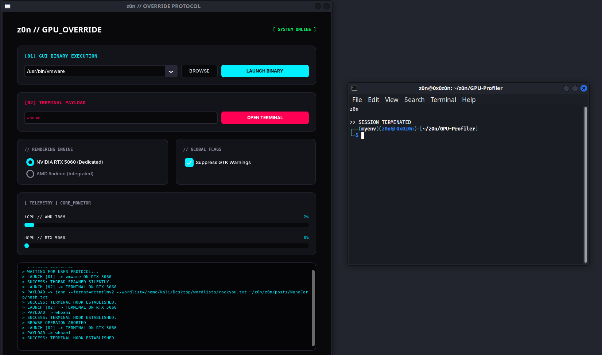
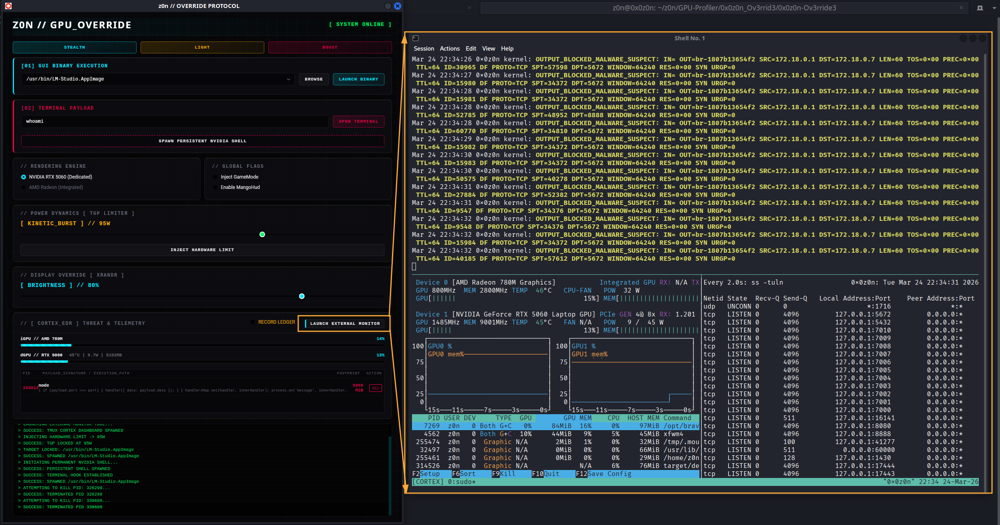

# z0n GPU Profiler

The **z0n GPU Profiler** is a specialized system utility developed for Linux environments (specifically optimized for Kali Linux on hybrid-graphics hardware). It provides a high-fidelity "cockpit" for managing **NVIDIA PRIME Render Offloading**, allowing for real-time telemetry and the targeted execution of security tools on dedicated hardware.

## System Architecture & Logic

The application serves as a high-level wrapper for the **NVIDIA Optimus** and **PRIME** protocols. It interacts directly with the Linux kernel and the NVIDIA binary driver to steer graphics and compute contexts.

### Dependencies

```bash
sudo apt update && sudo apt install -y zenity policykit-1 mangohud gamemode && pip install "customtkinter>=5.2.0"
```

sudo apt update && sudo apt install -y zenity policykit-1 mangohud gamemode && pip install "customtkinter>=5.2.0"



### 1. Execution Steering Logic

The core of the application lies in its environment variable injection. When the **NVIDIA Engine** is toggled, the application wraps the target binary in a sub-shell with the following variables:

| Variable                    | Value         | Functional Purpose                                                                                                                                           |
| :-------------------------- | :------------ | :----------------------------------------------------------------------------------------------------------------------------------------------------------- |
| `__NV_PRIME_RENDER_OFFLOAD` | `1`           | Enables **PRIME render offloading**, allowing the discrete GPU (dGPU) to perform rendering while the integrated GPU manages display output.                  |
| `__GLX_VENDOR_LIBRARY_NAME` | `nvidia`      | Forces the **GLX dispatcher** to load the NVIDIA OpenGL vendor library, ensuring OpenGL applications use the NVIDIA driver instead of Mesa or other vendors. |
| `__VK_LAYER_NV_optimus`     | `NVIDIA_only` | Routes **Vulkan API calls** through the NVIDIA Optimus layer so rendering is executed exclusively on the discrete GPU.                                       |


### 2. Dual-Stream Execution Modules

* **Module 01 (GUI):** Uses `subprocess.Popen` with `stderr=subprocess.DEVNULL`. This allows GUI tools like **VMware** or **Burp Suite** to run independently of the dashboard without hanging the main thread.
* **Module 02 (CLI):** Wraps the payload in `x-terminal-emulator`. It forces a `bash` context and uses `exec bash` at the end of the string to ensure the terminal window persists after the process crashes or terminates—essential for reviewing **Hashcat** or **Nmap** outputs.

## Power Dynamics & Hardware Override (TGP Limiter)

The Power Dynamics module introduces direct hardware-level Total Graphics Power (TGP) manipulation for NVIDIA dedicated GPUs. Instead of relying on passive OS scaling, users can now force hard power limits (in Watts) via a segmented GUI slider, optimizing the thermal-to-performance ratio on the fly.

### Power States Deck

The slider locks into four distinct hardware states:

* **[0] ECO_STEALTH (45W):** Aggressive undervolt profile. Maximizes battery life and enforces a zero/low-RPM fan curve. Best for UI work and 2D execution.
* **[1] NOMINAL_YIELD (70W):** The efficiency sweet spot. Delivers ~80% theoretical compute at 60% thermal output. Best for standard payloads and 60fps rendering.
* **[2] KINETIC_BURST (95W):** High-performance uplink. Sustains high boost clocks for AAA gaming and heavy CUDA operations. Thermal output will increase.
* **[3] OVERRIDE_MAX (115W):** Safety limiters disengaged. Unrestricted TGP delivery for maximum frame generation and benchmarking. Maximum fan acoustics.

### Technical Implementation

* **Execution:** Clicking "INJECT HARDWARE LIMIT" triggers `nvidia-smi -pl <watts>`.
* **Privilege Escalation:** Because power limits require root access, the protocol wraps the command in `pkexec`. This securely spawns a native GUI authentication prompt without locking the terminal or requiring a `sudo` password typed in plain text.
* **Failsafe:** If the user cancels the `pkexec` prompt, the application catches `returncode 126` or `127` and logs an "AUTHENTICATION ABORTED" event without crashing the main loop.

## Telemetry Engine (Hardware Monitoring)

The dashboard uses a dual-source polling engine to provide sub-second telemetry without high CPU overhead.

### NVIDIA Polling (dGPU) & Power Draw

The system invokes the `nvidia-smi` binary with specific query flags:
`nvidia-smi --query-gpu=utilization.gpu,memory.used,memory.total,temperature.gpu,power.draw --format=csv,noheader,nounits`
This returns raw integers and floats which are then mapped to the BMW M-Power circular gauges and digital readouts. The dashboard now tracks **real-time electrical draw (Wattage)** synchronously at 1000ms intervals alongside thermal and VRAM allocation metrics.



### AMD Polling (iGPU)

The system bypasses heavy binaries and reads directly from the **Linux sysfs virtual filesystem**. It polls:
`/sys/class/drm/card0/device/gpu_busy_percent`
This direct kernel-read method ensures the dashboard remains lightweight.

## UI & UX Design (M-Performance Aesthetic)

The interface is built using **CustomTkinter** for high-DPI scaling and modern styling.

* **Circular Gauges:** Custom-drawn `tk.Canvas` elements using trigonometry ($\cos/\sin$ math) to map percentages to degree angles ($225^\circ$ to $-45^\circ$).
* **Dynamic Colors:** The needle and digital readouts use a threshold logic. When utilization $>85\%$, the HEX color code shifts from **Neon Cyan** (`#3399FF`) to **M-Performance Crimson** (`#FF4400`).
* **Native Hooks:** Uses **Zenity** (`/usr/bin/zenity`) to provide a GTK-based file manager experience, allowing for native search and autocomplete that standard Python dialogs lack.


# System Integration: File Management & Terminal Logic

The **z0n GPU Profiler** is engineered to behave as a native extension of the Kali Linux ecosystem. By hooking into existing system binaries rather than relying on standard Python libraries, it provides a high-performance workflow optimized for SOC and Red Team operations.

## Modern File Management (Zenity Hook)

Standard Python file dialogs (`tkinter.filedialog`) are often functionally "blind"—they lack the indexing, search, and navigation capabilities required for rapid binary selection in a complex filesystem. This project bypasses those limitations by utilizing a **Zenity-driven GTK interface**.



### Key Capabilities:

* **Global Search:** Users can trigger `Ctrl+F` within the picker to instantly locate binaries deep within `/usr/bin/`, `/opt/`, or local project directories.
* **Path Autocomplete:** Supports native predictive typing, allowing for rapid navigation through the Linux directory structure without manual clicking.
* **Native Sidebar Access:** Provides immediate access to system-level shortcuts like `Home`, `Recent`, and `File System`, which are typically stripped in basic Python-based dialogs.
* **State Persistence:** Once a binary is selected, the path is automatically sanitized and cached in `z0n_launcher_favorites.json`. This creates a persistent "State Machine" that remembers your most critical tools across reboots.


## Persistent Terminal Override (Module 02)

When executing CLI-based payloads—such as **Hashcat**, **Nmap**, or custom exploitation scripts—visual feedback and log persistence are mandatory. The **Terminal Override** module ensures that no output is lost, even if a process terminates abruptly.



### Technical Implementation:

The dashboard constructs a specialized execution string passed to the system's `x-terminal-emulator`. This ensures that your preferred terminal (QTerminal, XFCE4-Terminal, etc.) is used.




**The Command Wrapper Logic:**

```bash
x-terminal-emulator -e bash -c "<GPU_ENV_VARS> <USER_COMMAND>; echo; echo '[PROCESS TERMINATED]'; exec bash"

```

### Why this is critical :

1. **Environment Injection:** It injects NVIDIA PRIME variables (`__NV_PRIME_RENDER_OFFLOAD=1`) *inside* the terminal session, ensuring the CLI tool explicitly recognizes the RTX 5060.
2. **Output Persistence:** By appending `exec bash`, the terminal window **stays open** after the command finishes. This allows you to review terminal output, copy-paste hashes, or analyze error logs without the window auto-closing.
3. **Independent Threading:** Utilizes `subprocess.Popen` to ensure the Terminal remains a detached child process, preventing the main M-Power Dashboard from hanging during long-running compute tasks.

## State Machine (JSON History)

The "Favorites" system acts as a lightweight, flat-file database for your workflow.

| Feature               | Logic                                                                                           |
| :-------------------- | :---------------------------------------------------------------------------------------------- |
| **Auto-Cache**        | Stores the **last 10 unique and successfully executed binary selections** for quick reuse.      |
| **Path Sanitization** | Automatically escapes and handles **spaces and shell-sensitive characters** in file paths.      |
| **Real-time Sync**    | The UI `CTkComboBox` **updates instantly** whenever a new binary target is selected and locked. |


## File Structure & State Management

| File                          | Description                                                                                                 |
| :---------------------------- | :---------------------------------------------------------------------------------------------------------- |
| `Powerprofile.py`             | Main Python application containing the **core logic and graphical user interface implementation**.          |
| `z0n_launcher_favorites.json` | Local configuration file storing the **10 most recently executed binary paths** for quick access and reuse. |

## Maintenance & Troubleshooting

### Common Fixes:

1. **"Zenity not found":** Ensure `sudo apt install zenity` is run; the "Browse" button depends on this system hook.
2. **Telemetry at 0%:** Verify the NVIDIA drivers are loaded via `lsmod | grep nvidia`. If the driver is not active, `nvidia-smi` calls will fail.
3. **Permission Denied:** Ensure the binaries you are trying to launch have the executable bit set (`chmod +x`).
4. **"pkexec not found":** If the Power Dynamics slider fails to authenticate, ensure the `policykit-1` package is installed on your distribution.

